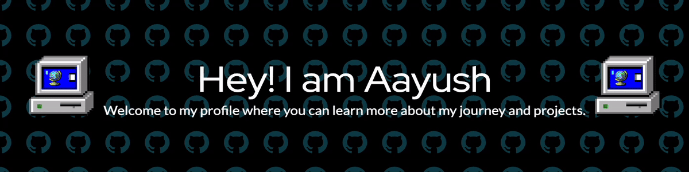

  

## 🌟 About Me
- 🎓 **Bachelor of Engineering in Computer Science** from Manipal University Jaipur.
- 🌱 Continuously learning and improving my coding skills. The tech world never stops, and I'm on a never-ending journey to stay up-to-date.
- 👯 Looking to collaborate on exciting open-source projects. Have a cool idea? Let's bring it to life together!
- 💬 Ask me anything about coding, web development, or the latest tech trends. I'm always up for a good tech chat.
- 📫 Connect with me on [LinkedIn](https://www.linkedin.com/in/aayusharora14/). Let's chat about all things tech!

## 🚀 Currently Working On
- 🔭 **InvestoHub**: An exceptional project making investing in Property, Gold, and Bitcoin more accessible and fun! Adding a real-time news service to keep you informed.

<h2>💻 Tech Stash 💻</h2>

  <h3>Languages:</h3> 

     
     
    
     
    
    
    
    
    
  

  
  <h3>Tools of the Trade:</h3>
  

    
     
    
    
    
    
  

  

    Magic Spells: Data Structures, Design and Analysis of Algorithms, Computer Network, RDBMS, OS
  

---

  
  
  

Feel free to explore my projects, connect with me on social media, and reach out if you want to collaborate or just chat about tech!

